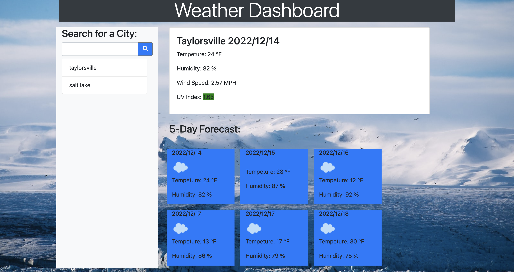

# Weather-forecast

## By: Miles Fonua

## Table of Contents
- [Introduction](#Introduction)
- [Deployment](#Deployment)
- [Technology](#Technology)
- [Installation](#Installation)
- [Questions](#Questions)

  ### Introduction
  
  The Weather Forecast is an app that tells the user the Future forcast as well as the current weather forecast. The weather forecast not only shows the temperature, but the current as well as projected humidity, air preassure, and wind speed.

 ### Deployment
 https://mffonua.github.io/Weather-forecast/ 

### Installation

* To install the user must have access to the Internet; Once connected to the internet the user must enter in the url https://mffonua.github.io/Weather-forecast. After clicking enter the user is then led to the Weather Forecast app and is able to use the website.

### Technology

* My apple-mac laptop
Website Resources
* W3 Schools
* Open Weather map API
* Lots of Youtube

### Questions
For questions, comments, or suggestions, please reach out to me via email at <a href="mailto:myles.fonua@gmail.com">myles.fonua@gmail.com</a>.

### Social Media

[LinkedIn](https://www.linkedin.com/in/miles-fonua-24b791237/)
 
[GitHub](https://github.com/mffonua)